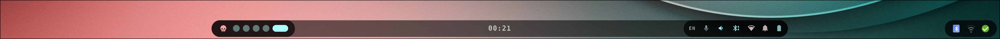

# Bar

The main Hyprland panel — anchored to the bottom edge, centered, ~36% monitor width.

- **Left** — power-menu trigger (Hyprland logo) + workspace switcher (pill dots, 1–5)
- **Center** — clock (`HH:MM`); tooltip shows the date, click opens GNOME Calendar
- **Right** — recording dot, keyboard layout (EN/DE), mic, volume, bluetooth, wifi,
  notifications (with badge), battery

The mic icon turns into a **white-on-red circle** while any app is recording, and a
red dot appears whenever `gpu-screen-recorder` is running (click it to stop).

Colors hot-reload from `~/.cache/wal/colors.json`.
