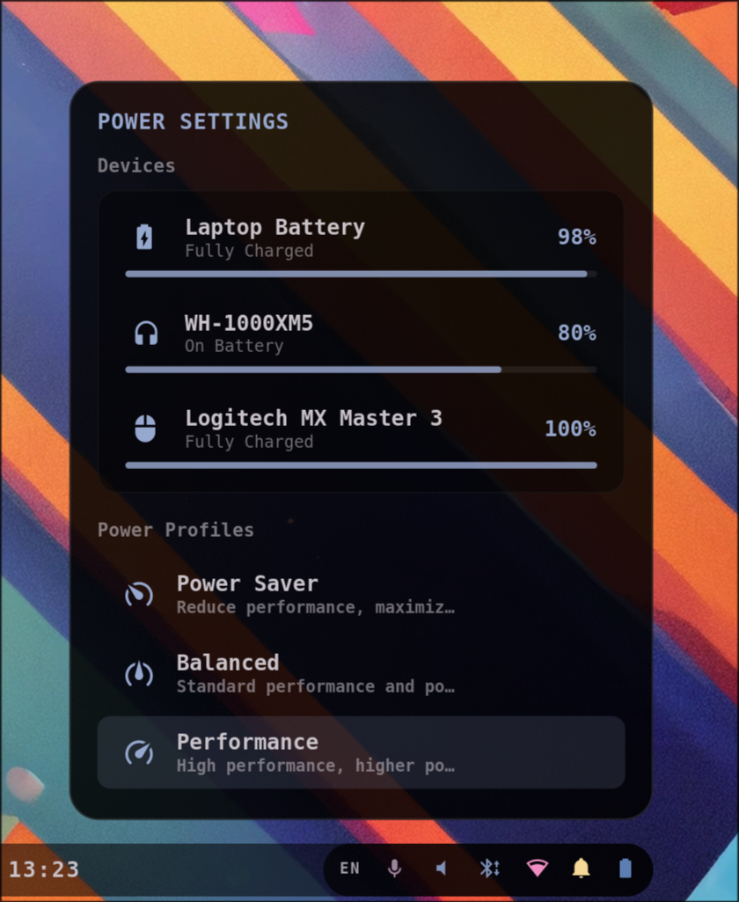

# Bluetooth

An interactive Bluetooth Management Widget that slides up from the bottom-right of the screen, directly aligned above the status segment of the bar. It allows full management of your Bluetooth adapters and devices.

- **Power Toggle** — easily turn Bluetooth on or off with an interactive header button.
- **Discovery Scanner** — toggle active adapter scanning to discover nearby available devices with live loading indicators.
- **Dynamic Device List** — lists all paired, connected, and available devices, grouped by status.
- **Device Category Icons** — automatically displays highly descriptive Nerd Font icons based on the device type (e.g. headsets `󰋋`, keyboards `󰌌`, mice `󰍽`, phones `󰏲`).
- **Interactive Connections** — single-click any device to connect or disconnect instantly.
- **Dismiss on click-outside** — close the panel instantly by clicking anywhere else on the screen or pressing the `Escape` key.

Driven natively by Bluez over AstalBluetooth. Colors match the bar and hot-reload from `~/.cache/wal/colors.json`.
