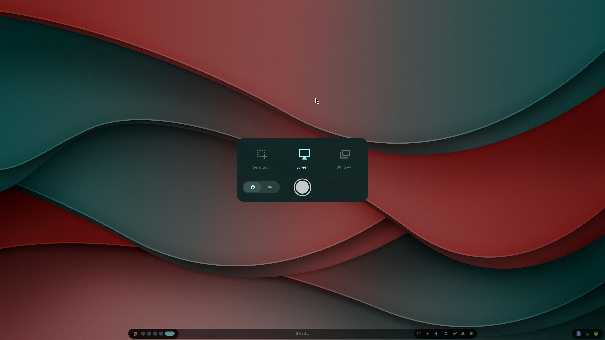

# Capture

A centered overlay for screenshots and screen recordings. Toggle with **`Print`**.

- **Mode cards** — Selection (region), Screen, or Window
- **Kind toggle** — screenshot (󰄄) or video (󰕧)
- **Shutter** — captures the current mode/kind; while recording it turns red and
  acts as a stop button. **`Space`** or **`Enter`** also fires the shutter.
- **Recording options** — toggle microphone capture and a `wshowkeys` key-press
  overlay for videos.

`Esc` or a click outside the panel closes it. The actual work is done by
[`~/.config/hypr/scripts/capture.sh`](../../../../../hyprland/.config/hypr/scripts/capture.sh)
`<kind> <mode> [mic|no-mic] [keys|no-keys]` (and `capture.sh stop`).
