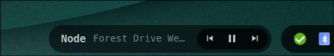

# Media

A compact MPRIS player popup that sits along the bottom edge, in the gap between
the centered bar and the tray. **Only visible when a player is active** (Playing
or Paused).

- **Title / artist** — current track (title bold, artist dimmed), ellipsized
- **Controls** — previous / play-pause / next, grouped in their own darker pill

Driven by [`playerctl`](https://github.com/altdesktop/playerctl), polled once a
second. Colors match the footer bar and hot-reload from `~/.cache/wal/colors.json`.
