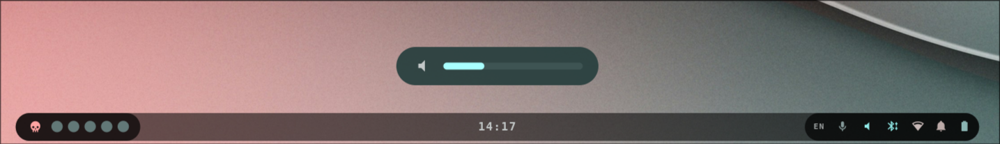

# OSD

An on-screen display that pops up centered above the bar whenever the **volume**
or **screen brightness** changes. Auto-hides 1.6s after the last change.

- **Icon** — speaker (volume level) or sun (brightness level)
- **Level bar** — current value, 0–100%

Volume is read from `AstalWp` (`defaultSpeaker`); brightness is detected by
monitoring `/sys/class/backlight/intel_backlight/brightness`, so it reacts to any
tool (e.g. `brightnessctl`) regardless of the keybind used. Colors hot-reload from
`~/.cache/wal/colors.json`.
