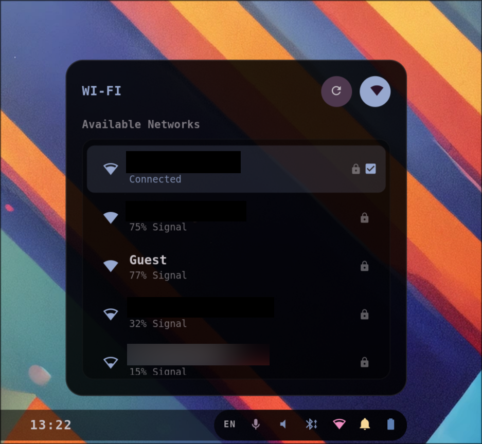

# Power

An interactive Power Configuration Widget that slides up from the bottom-right of the screen, directly aligned above the battery segment of the bar. It allows configuring system power performance and monitoring peripheral batteries.

- **Power Profiles Switcher** — quickly toggle between system-wide **Power Saver** (`󰾆`), **Balanced** (`󰾅`), and **Performance** (`󰓅`) profiles.
- **Peripheral Battery Monitoring** — displays real-time battery status and charge percentage for your laptop battery, mouse (e.g. Logitech MX Master 3), and wireless headset/headphones.
- **Subtle Progress Bars** — includes beautiful, non-obtrusive, color-filled level indicators (at 80% opacity) under each device to visualize battery drain at a glance.
- **Interactive Toggles** — clicking the battery button in the main AGS bar slides this menu open.
- **Dismiss on click-outside** — close the panel instantly by clicking anywhere else on the screen or pressing the `Escape` key.

Driven natively by `power-profiles-daemon` (via `powerprofilesctl`) and `UPower` (via AstalBattery). Colors match the bar and hot-reload from `~/.cache/wal/colors.json`.
