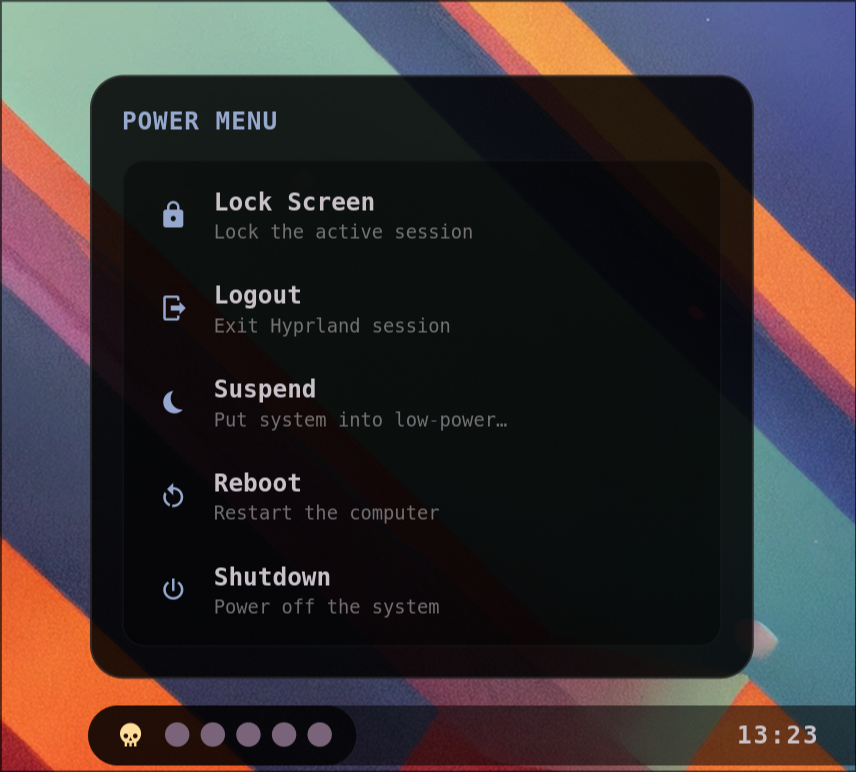

# Power Menu

An interactive Power and Session Management Widget that slides up from the bottom-left of the screen, directly aligned above the skull logo segment of the bar. It allows controlling the system state.

- **Lock Screen** — locks the current session using `hyprlock`.
- **Logout** — exits the active Hyprland compositor session.
- **Suspend** — puts the computer into low-power sleep mode via `systemctl suspend`.
- **Reboot** — restarts the computer safely.
- **Shutdown** — powers off the machine safely.
- **Dismiss on click-outside** — close the panel instantly by clicking anywhere else on the screen or pressing the `Escape` key.

Driven natively by systemd and Hyprland. Colors match the bar and hot-reload from `~/.cache/wal/colors.json`.
