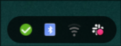

# Tray

StatusNotifierItem (system tray) icons, anchored to the bottom-right corner.
Only visible when at least one tray item exists.

- **Left-click** activates the app
- **Right-click** (popover) exposes the app's own menu — e.g. Quit/Exit for
  Zoom, Discord, etc.

Needs `AstalTray` (built from source by `install.sh`). Colors hot-reload from
`~/.cache/wal/colors.json`.
