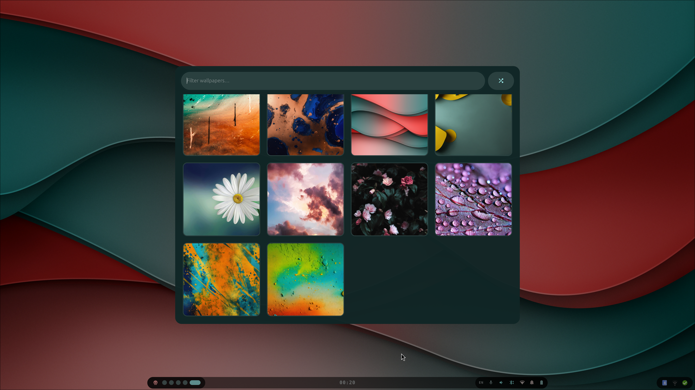

# Wallpaper

A centered wallpaper picker showing a 4-column grid of previews. Toggle with
**`Super+W`** (`Super+Shift+W` sets a random one without opening the picker).

- **Search field** — live filter by filename (focused on open)
- **Grid** — click a thumbnail to apply it
- **Shuffle button** (󰒝) — pick a random wallpaper

Images are read from `~/Pictures/Wallpaper` (png/jpg only — webp has no loader here,
so same-named webp copies are deduped out). Selection runs
`~/.config/hypr/scripts/wallpaper.sh <path>` (or `wallpaper.sh random`). `Esc` or a
click outside closes it.
