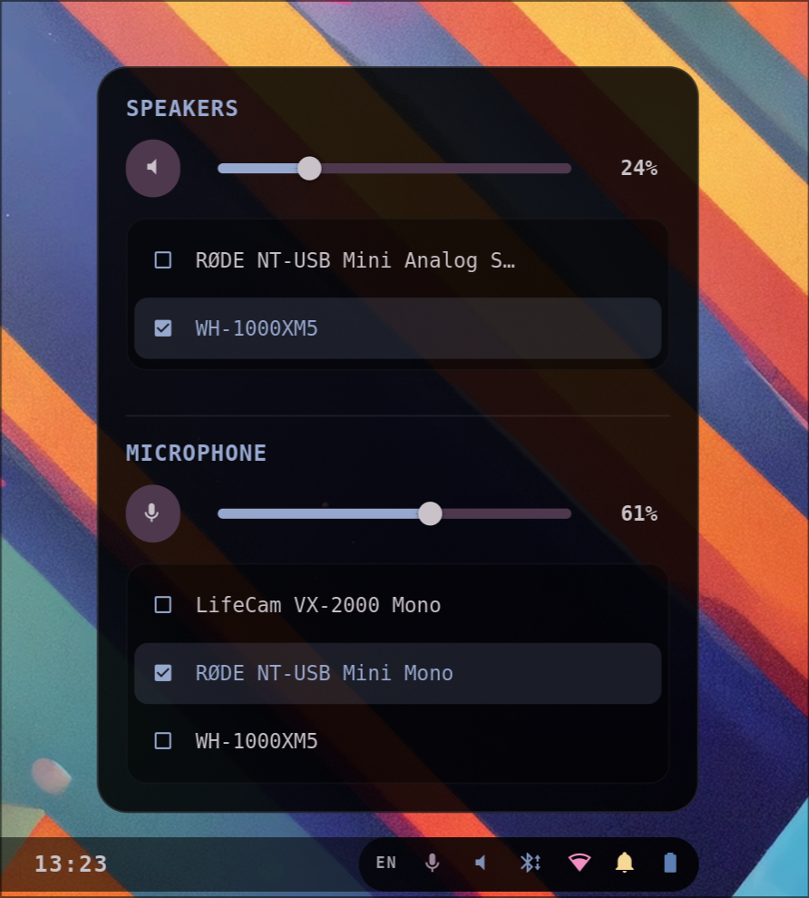

# Wi-Fi

An interactive Wi-Fi Connection Widget that slides up from the bottom-right of the screen, directly aligned above the status segment of the bar. It allows discovering and connecting to Wi-Fi access points.

- **Power Toggle** — easily enable or disable Wi-Fi with an interactive header button.
- **Access Point Discovery** — automatically triggers network scans and displays available SSIDs in real-time.
- **Smart Sorting & Deduplication** — groups access points by SSID, filters out weaker duplicates, and sorts your active connection to the absolute top of the list.
- **Connection Strengths** — displays live-updating Nerd Font signal strength icons (ranging from `󰤟` to `󰤨`).
- **Dismiss on click-outside** — close the panel instantly by clicking anywhere else on the screen or pressing the `Escape` key.

Driven natively by NetworkManager over AstalNetwork. Colors match the bar and hot-reload from `~/.cache/wal/colors.json`.
